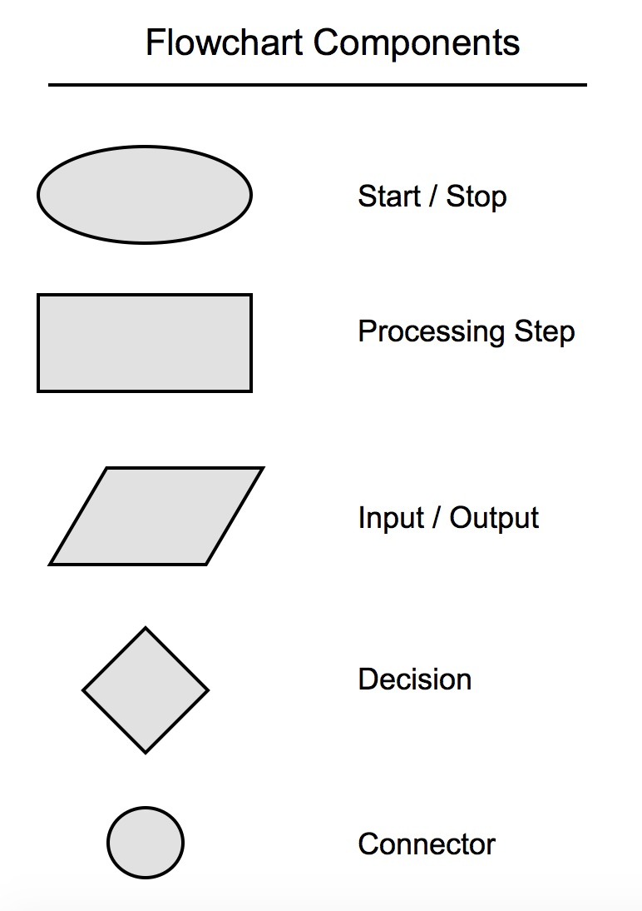

# False values in Python
    There are 12 in total

- False
- None
- 0
- 0.0
- 0j
- "" an emtpy string
- [] an empty list
- {} an empty dictionary
- () an empty tuple
- set() an empty set
- frozenset() an empty frozen set
- range(0) an empty range

# Pseudocode

Before we can take our pseudocode and translate it to program code, we must formalize the pseudocode a little more. We'll still use English, but we'll use some keywords to help us break down the program logic into concrete commands, which makes translating to code more natural.

We'll use the below keywords to assist us, along with their meaning.

Keyword	Meaning
START	start of the program
SET	set a variable that we can use for later
GET	retrieve input from user
PRINT	display output to user
READ	retrieve a value from a variable
IF/ELSE IF/ELSE	show conditional branches in logic
WHILE	show looping logic
END	end of the program

# Flowchart Components

Used to determine logic flow in a program

-
- oval: start/stop
- rectangle: processing step - define variables here
- rhombus: input/output 
- Diamond: decision, only has two branches
    - If decision w/ > 3 branches, user seperate diamonds
- Circle: connector

# Pylint

- C: (Convention) for programming standard       violation
- R: (Refactor) for bad code smell
- W: (Warning) for Python specific problems
- E: (Error) for semantic errors that cause broken code
- F: (Fatal) for errors which prevented further processing

- Use a .pylintrc file for configurations to modify how strict it is on grading. Create this in your project directory

# Refactoring calcualtor program

- Use helper functions to wrap up repetetive code
- Use try and except statement and a while loop to evaluate if 
something is true to validate waht the user inputs

# Precedance rules - top to bottom

Operators	Meaning
()	Parentheses
**	Exponent
+x, -x, ~x	Unary plus, Unary minus, Bitwise NOT
*, /, //, %	Multiplication, Division, Floor division, Modulus
+, -	Addition, Subtraction
<<, >>	Bitwise shift operators
&	Bitwise AND
^	Bitwise XOR
|	Bitwise OR
==, !=, >, >=, <, <=, is, is not, in, not in	Comparisons, Identity, Membership operators
not	Logical NOT
and	Logical AND
or	Logical OR

# Important String methods

Method	        Description
capitalize()	Converts the first character to upper case
casefold()	    Converts string into lower case
center()	    Returns a centered string
count()	        Returns the number of times a specified value occurs in a string
encode()	    Returns an encoded version of the string
endswith()	    Returns true if the string ends with the specified value
expandtabs()	Sets the tab size of the string
find()	        Searches the string for a specified value and returns the position of where it was found
format()	    Formats specified values in a string
format_map()	Formats specified values in a string
index()	        Searches the string for a specified value and returns the position of where it was found
isalnum()	    Returns True if all characters in the string are alphanumeric
isalpha()	    Returns True if all characters in the string are in the alphabet
isascii()	    Returns True if all characters in the string are ascii characters
isdecimal()	    Returns True if all characters in the string are decimals
isdigit()	    Returns True if all characters in the string are digits
isidentifier()	Returns True if the string is an identifier
islower()	    Returns True if all characters in the string are lower case
isnumeric()	    Returns True if all characters in the string are numeric
isprintable()	Returns True if all characters in the string are printable
isspace()	    Returns True if all characters in the string are whitespaces
istitle()	    Returns True if the string follows the rules of a title
isupper()	    Returns True if all characters in the string are upper case
join()	        Converts the elements of an iterable into a string
ljust()	        Returns a left justified version of the string
lower()	        Converts a string into lower case
lstrip()	    Returns a left trim version of the string
maketrans()	    Returns a translation table to be used in translations
partition()	    Returns a tuple where the string is parted into three parts
replace()	    Returns a string where a specified value is replaced with a specified value
rfind()	        Searches the string for a specified value and returns the last position of where it was found
rindex()	    Searches the string for a specified value and returns the last position of where it was found
rjust()	        Returns a right justified version of the string
rpartition()	Returns a tuple where the string is parted into three parts
rsplit()	    Splits the string at the specified separator, and returns a list
rstrip()	    Returns a right trim version of the string
split()	S       plits the string at the specified separator, and returns a list
splitlines()	Splits the string at line breaks and returns a list
startswith()	Returns true if the string starts with the specified value
strip()	        Returns a trimmed version of the string
swapcase()	    Swaps cases, lower case becomes upper case and vice versa
title()	        Converts the first character of each word to upper case
translate()     Returns a translated string
upper()	        Converts a string into upper case
zfill()	        Fills the string with a specified number of 0 values at the beginning