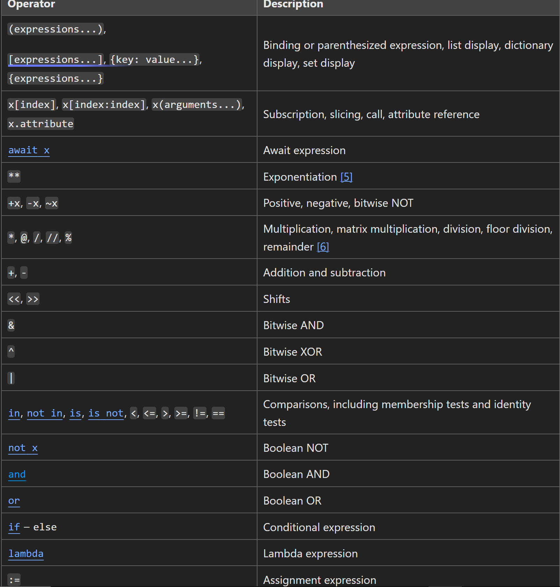

# False values in Python
    There are 12 in total

- False
- None
- 0
- 0.0
- 0j
- "" an emtpy string
- [] an empty list
- {} an empty dictionary
- () an empty tuple
- set() an empty set
- frozenset() an empty frozen set
- range(0) an empty range

# Pseudocode

Before we can take our pseudocode and translate it to program code, we must formalize the pseudocode a little more. We'll still use English, but we'll use some keywords to help us break down the program logic into concrete commands, which makes translating to code more natural.

We'll use the below keywords to assist us, along with their meaning.

Keyword	Meaning
START	start of the program
SET	set a variable that we can use for later
GET	retrieve input from user
PRINT	display output to user
READ	retrieve a value from a variable
IF/ELSE IF/ELSE	show conditional branches in logic
WHILE	show looping logic
END	end of the program

# Flowchart Components

Used to determine logic flow in a program

-
- oval: start/stop
- rectangle: processing step - define variables here
- rhombus: input/output 
- Diamond: decision, only has two branches
    - If decision w/ > 3 branches, user seperate diamonds
- Circle: connector

# Pylint

- C: (Convention) for programming standard       violation
- R: (Refactor) for bad code smell
- W: (Warning) for Python specific problems
- E: (Error) for semantic errors that cause broken code
- F: (Fatal) for errors which prevented further processing

- Use a .pylintrc file for configurations to modify how strict it is on grading. Create this in your project directory

# Refactoring calcualtor program

- Use helper functions to wrap up repetetive code
- Use try and except statement and a while loop to evaluate if 
something is true to validate waht the user inputs

# Precedance rules - top to bottom

Operators	Meaning
()	Parentheses
**	Exponent
+x, -x, ~x	Unary plus, Unary minus, Bitwise NOT
*, /, //, %	Multiplication, Division, Floor division, Modulus
+, -	Addition, Subtraction
<<, >>	Bitwise shift operators
&	Bitwise AND
^	Bitwise XOR
|	Bitwise OR
==, !=, >, >=, <, <=, is, is not, in, not in	Comparisons, Identity, Membership operators
not	Logical NOT
and	Logical AND
or	Logical OR

# Important String methods

Method	        Description
capitalize()	Converts the first character to upper case
casefold()	    Converts string into lower case
center()	    Returns a centered string
count()	        Returns the number of times a specified value occurs in a string
encode()	    Returns an encoded version of the string
endswith()	    Returns true if the string ends with the specified value
expandtabs()	Sets the tab size of the string
find()	        Searches the string for a specified value and returns the position of where it was found
format()	    Formats specified values in a string
format_map()	Formats specified values in a string
index()	        Searches the string for a specified value and returns the position of where it was found
isalnum()	    Returns True if all characters in the string are alphanumeric
isalpha()	    Returns True if all characters in the string are in the alphabet
isascii()	    Returns True if all characters in the string are ascii characters
isdecimal()	    Returns True if all characters in the string are decimals
isdigit()	    Returns True if all characters in the string are digits
isidentifier()	Returns True if the string is an identifier
islower()	    Returns True if all characters in the string are lower case
isnumeric()	    Returns True if all characters in the string are numeric
isprintable()	Returns True if all characters in the string are printable
isspace()	    Returns True if all characters in the string are whitespaces
istitle()	    Returns True if the string follows the rules of a title
isupper()	    Returns True if all characters in the string are upper case
join()	        Converts the elements of an iterable into a string
ljust()	        Returns a left justified version of the string
lower()	        Converts a string into lower case
lstrip()	    Returns a left trim version of the string
maketrans()	    Returns a translation table to be used in translations
partition()	    Returns a tuple where the string is parted into three parts
replace()	    Returns a string where a specified value is replaced with a specified value
rfind()	        Searches the string for a specified value and returns the last position of where it was found
rindex()	    Searches the string for a specified value and returns the last position of where it was found
rjust()	        Returns a right justified version of the string
rpartition()	Returns a tuple where the string is parted into three parts
rsplit()	    Splits the string at the specified separator, and returns a list
rstrip()	    Returns a right trim version of the string
split()	S       plits the string at the specified separator, and returns a list
splitlines()	Splits the string at line breaks and returns a list
startswith()	Returns true if the string starts with the specified value
strip()	        Returns a trimmed version of the string
swapcase()	    Swaps cases, lower case becomes upper case and vice versa
title()	        Converts the first character of each word to upper case
translate()     Returns a translated string
upper()	        Converts a string into upper case
zfill()	        Fills the string with a specified number of 0 values at the beginning

- and and or do not have precedence, in an expression it goes left to right. **All 8 comparison operations have same priority (but higher than boolean operations)** in and not in have same priorities as comparison operations
- For short circuting, or statements return the first truthy element or they return the last falsy element
- the and statement returns teh last truthy element and the first falsy one
**Note that neither and nor or restrict the value and type they return to False and True, but rather return the last evaluated argument. This is sometimes useful, e.g., if s is a string that should be replaced by a default value if it is empty, the expression s or 'foo' yields the desired value. Because not has to create a new value, it returns a boolean value regardless of the type of its argument (for example, not 'foo' produces False rather than ''.)**
- python will print the last element in an expression to the terminal
- remember [none] is actually 

# Dict view objects

- the .keys() method returns a dictionary view object and not an actual list. If you print it it will print with ([]) which shows its not an actual list
- dict view objects are dynamic, so changes to the dict will show in all of them

# PY101 study guide - all topics

## Naming Conventions
Naming conventions: legal vs. idiomatic, illegal vs. non-idiomatic
- Closely related to the stylistic conventions discussed in the Using Python chapter are the Python naming conventions. Names that follow these conventions are idiomatic. In contrast, those that do not are non-idiomatic (valid but not idiomatic) or illegal (your code will either raise a syntax error or do something unexpected).

- Naming conventions for most identifiers (excluding constant and class names):

    Use snake_case formatting for these names.
    Names may contain lowercase letters (a-z), digits (0-9), and underscores (_).
    Names should begin with a letter.
    If the name has multiple words, separate the words with a single underscore (_).
    Names that begin or end with one or two underscores have special meaning under the naming conventions. Don't use them until you understand how they are used.
    Names may only use letters and digits from the standard ASCII character set.
- Idiomatic Names:
    foo
    answer_to_ultimate_question
    eighty_seven
    index_2
    index2
- Constant names (unchanging named values):

    Use SCREAMING_SNAKE_CASE formatting for these names.
    Names may contain uppercase letters (A-Z), digits (0-9), and underscores (_).
    Names should begin with a letter.
    If the name has multiple words, separate the words with a single underscore (_).
    Names that begin or end with one or two underscores have special meaning under the naming conventions. Don't use them until you understand how they are used.
    Names may only use letters and digits from the standard ASCII character set.
- Idiomatic Names:
    FOO
    ANSWER_TO_ULTIMATE_QUESTION
    EIGHTY_SEVEN
    INDEX_2
    INDEX2

- Class names:

    Use PascalCase formatting for these names. PascalCase is sometimes called CamelCase (with both Cs capitalized).
    Names may contain uppercase and lowercase letters (A-Z, a-z) and digits (0-9).
    Names should begin with an uppercase letter.
    If the name has multiple words, capitalize each word.

- Idiomatic Names
    Foo
    UltimateQuestion
    FourLeggedPets
    PythonVersion2Rules

- Note that many non-idiomatic names are still legal (valid) Python identifiers. Sometimes, it makes sense to break the rules. However, not all identifiers are legal; here are some things you must do:

    You can use letters, digits, and underscores in Python identifiers. Extended ASCII and Unicode letters and digits are allowed.
    You may not use punctuation characters, most special characters, or whitespace.
    You may not start identifiers with a digit.
    You may not use Python's reserved words such as if, def, while, return, and pass as names.

- Non-Idiomatic Names	Explanation
    fourWayIntersection:	camelCase
    Schön:	Extended ASCII

    Illegal Names	Explanation
    pass:	        Reserved word
    3xy:	        Starts with digit
    ultimate-question:	Hyphen
    one two three:	Whitespace
    is_lowercase?:	Punctuation
    is+lowercase:	Special character

- Most illegal names will raise an error. However, if the illegal name looks like valid Python, you won't get an error.

- Variable names are often referred to by the broader term identifiers. In Python, identifiers refer to several things:
    - Variable and constant names
    - Function and method names
    - Function and method parameter names
    - Class and module names

## type coercions: explicit (e.g., using int(), str()) and implicit

- Explicit type coercioin occurs when a programmer intentionally employs built in functions to convert a value of one type to another.
    - For example, using int() to convert a string from input() if we are asking for an int input
    - Trying to convert a non-numberic string to an integer using int() will raise a ValueError
    - int() will accept also a real number (floating point), bytes-like object, and also boolean values (because they can evaluate to 1 and 0)
    - any other data type passed to int(), for example a list, will raise a TypeError
    - floats have a special "Not-a-number" value
    - print() automatically will call the str() function. str() works with all buiilt in python data types and most non-built in types
    - Note: repr() will print a string representation of an object. For example, printing the list [1, 2, 3] with print() will print the values,
    however repr of that will print '[1, 2, 3]'. This can be used to recreate the object later on

- Implicit type conversion (automatic data type conversation), when python automatically transofmrs one dat typoe into another without the programers
direct instruction. Typically occurs when mixing distinct data types
    - For example: calculations between an int and a float, python will convert the int to a float
    - print() will implicitly convert any non-string arguments to a string

## numbers, including handling exceptions (ValueError, ZeroDivisionError)
- Numeric values represent numbers. Numbers can be added, subtracted, multiplied, and divided and can be used in a wide variety of mathematical operations. 
- Int represents integers, aka whole numbers, to include negative whole numbers
- Python also supports other numeric types, such as complex, decimal, and fractional numbers.
- You can break up numbers with underscores: 123_456_789. Commas and decimals are not valid seperators
- Floats represent real numbers: includes integers and numbers with digits after the decimal point
- scientific notation is: 10**n, where n is positive, represents a 1 followed by n zeroes
- Python will print large and small floats w/ scientific notation
print(3.14 * (10**20))        # 3.14e+20
print(3.14 * (10**-20))       # 3.14e-20

- Can also do this:
print(3.14e+20 / 2.72e-15)    # 1.1544117647058823e+35

- Integers DO NOT get printed with scientific notation
- Must do this:
print(int(3e+20))             # 300000000000000000000

- If python interpreter cannot continue executing a program: creates an Exception Object that describes problem and stops the program
    - This is called "raising an exception"
    - Example, trying to cast a string to a float creates a **value error**
    - zero division error is when denom is zero

## strings
Examples: 
'Hello!'
"He's pining for the fjords!"
'1969-07-20'
f'{greeting}! My name is {my_name}'
r'\w+\d+'

- Also includes byte string sequences
- text sequence vs ordinary sequence: text sequence (string) does not contain any objects, only the characters (bytes) that make up the text. These are not objects, simply part of the value
- Escaping quotations:
    print("""My nickname is "Wolfy". What's yours?""")
    print('My nickname is "Wolfy". What\'s yours?')
    print("My nickname is \"Wolfy\". What's yours?")
- Both of these print C:\Users\Xyzzy
print("C:\\Users\\Xyzzy")  # Each \\ produces a literal \
print(r"C:\Users\Xyzzy")  # raw string literal

## f-strings
- primarily used for string interpolation
- can be used instead of the format method
- can also escape {} by doing {{}} in f strings
- f strings for numbers:
    print(f'{123456789:_}')       # 123_456_789
    print(f'{123456789:,}')       # 123,456,789
- f strings for floats:
    print(f'{123456.7890123:_}')  # 123_456.7890123
    print(f'{123456.7890123:,}')  # 123,456.7890123

### string methods 
1. capitalize - return a copy of the string w/ first character capitalized and the rest lowercased
    str.capitalize()
2. swapcase - return a copy of string w/ uppercase characters to lowercase and vice versa. Note not necessarily true that
str.swapcase().swapcase() == str (because of non ASCII chars)
str.swapcase()
3. upper - return copy of string w/ all cased chars converted to uppercase. Note str.upper().isupper() might be flase if str 
contains uncased characters or if the unicode catergory of the resulting char is not "Lu" (letter, uppercase) but "Lt" (letter, titlecase)
    \p{Lu} or \p{Uppercase_Letter}: an uppercase letter that has a lowercase variant.
    \p{Lt} or \p{Titlecase_Letter}: a letter that appears at the start of a word when only the first letter of the word is capitalized.
str.upper()
4. lower - return copy of string w/ all cased chars converted to lowercase.  Used 'default case folding' from unicode standard
str.lower()
5. isalpha - return **True** if all chars in str are alphabetic and there is at least one char, **False** otherwise. 
    Defined by uncode char database as "Letter": “Lm”, “Lt”, “Lu”, “Ll”, or “Lo”
str.isalpha()
6. isdigit - return **True** if all chars in str are digits and there is at least one char, **False** otherwise. 
    Digits include: decimal chars and digits that need special handling such as compatability superscript digits
    Formally: digit has property value Numeric_Type=Digit or Numeric_Type =Decimal.
7. isalnum - return **True** if all char in str are alphanumeric and there is at least one char, **False** otherwise.
    Char 'c' is alphanumeric if one of the following returns **True**: c.isalpha(), c.isdecimal(), c.isdigit(), or c.isnumeric()
8. islower - return **True** if all cased chars in str are lowercase and there is at least one cased character, **False** otherwise
9. isupper - return **True** if all cased chars in str are uppercase and there is at least one cased character, **False** otherwise
10. isspace - Return **True** if there are only whitespace chars in str and there is at least one char, **False** otherwise
11. strip - str.strip([chars]) - return copy of str w/ leading and trailing characters removed. Chars argu ment is a string
    specifying set of chars to be removed. If ommitted or **None**, chars arg defualts to removing whitespace.
    Chars arg not a prefix or suffic, all combos are stripped.
    Exampe: '   spacious   '.strip()
                'spacious'
            'www.example.com'.strip('cmowz.')
            'example'
12. rstrip - str.rstrip([chars]) -return copy of str w/ trailing chars removed. Same specifications for argument as strip, not a suffix.
13. lstrip - str.lstrip([chars]) - return copy of string w/ leading chars removed. Same specifications for argument as strip, not a prefix.
14. replace - str.replace(old, new[, count]) - return copy of str w/ all occurrences of substring *old* replaced by *new*.
    If optional argu ment *count* is given, only the first *count* occurrernces are replaced
15. split - 
16. find, 
17. rfind

## boolean vs. truthiness
## None
ranges
list and dictionary syntax
list methods: len(list), list.append(), list.pop(), list.reverse()
dictionary methods: dict.keys(), dict.values(), dict.items(), dict.get()
operators
    Arithmetic: +, -, *, /, //, %, **
    String operators: +
    List operators: +
    Comparison: ==, !=, <, >, <=, >=
    Logical: and, or, not
    Identity: is, is not
    operator precedence
mutability and immutability
variables
    naming conventions
    initialization, assignment, and reassignment
    scope
    global keyword
    variables as pointers
    variable shadowing
conditionals and loops
    for
    while
print() and input()
Functions:
    definitions and calls
    return values
    parameters vs. arguments
    nested functions
    output vs. return values, side effects
expressions and statements
discuss a function's use and purpose (a "user-level" description) instead of its implementation